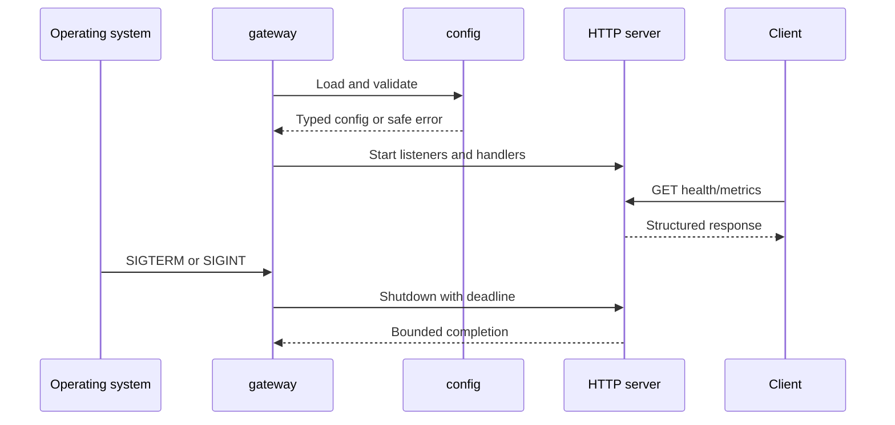

# M0 Bootstrap Design

## Context

MCPShield starts as a single Go gateway process. M0 must establish lifecycle and
operability contracts while keeping the code small enough to change when M1 introduces
MCP transport and upstream routing.

## Components

| Component | Responsibility | Boundary |
| --- | --- | --- |
| `cmd/gateway` | Process assembly, signal handling, and exit status | Owns startup and shutdown wiring only. |
| `internal/config` | Parse and validate typed configuration | No HTTP or logging side effects. |
| `internal/httpapi` | Route health and metrics endpoints and apply request limits | Does not own process lifecycle. |
| `internal/observability` | Configure `slog` and Prometheus instrumentation | Must redact configured secret fields. |
| `internal/runtime` | Coordinate server lifecycle and owned resources | Encodes bounded shutdown behavior. |

## Interfaces

- Configuration returns a validated immutable value or a field-scoped error.
- Readiness receives an explicit dependency status rather than probing arbitrary services.
- The runtime owns the `http.Server` and invokes shutdown with a context deadline.
- Handlers return structured JSON for health responses and do not expose internal errors.

## Request lifecycle

## Error handling

- Configuration errors are returned during startup and include a field name, not a value.
- Handler errors use a stable JSON error shape and generic messages.
- Shutdown errors are logged with an event name and cause process failure only when the
  server cannot stop within the configured deadline.
- No request or configuration secret is included in logs, metrics labels, or traces.

## Security considerations

- Bind address defaults to a local-safe value for development.
- Request bodies have an explicit maximum size.
- Server and shutdown timeouts are explicit and validated as positive durations.
- Secret configuration keys are redacted by name in diagnostics.
- M0 does not claim authentication, authorization, TLS, or MCP security enforcement.

## Testing strategy

- Unit tests cover parsing, validation, health response shapes, redaction, and metrics.
- Integration tests start the gateway on an ephemeral address and exercise endpoints.
- Shutdown tests send a real process signal or invoke the runtime signal path with a
  controlled context and assert bounded completion.
- The first implementation PR runs `go test ./...`, `go test -race ./...`, `go vet ./...`,
  and `docker compose config`.

## Risks and mitigations

| Risk | Mitigation |
| --- | --- |
| M0 grows into a framework decision | Keep handlers on `net/http` and defer router adoption until M1 needs it. |
| Readiness becomes a false dependency probe | Use an explicit readiness state owned by runtime wiring. |
| Logging leaks future credentials | Add redaction tests before adding credential-bearing configuration. |
| Shutdown test passes without exercising cancellation | Use a blocked request and a deadline-bounded integration test. |

## Tech decisions

| Decision | Choice | Rationale |
| --- | --- | --- |
| Initial HTTP stack | `net/http` | The M0 surface is small and standard-library behavior is easy to test. |
| Process shape | `cmd/gateway` only | No second scaling or security boundary exists yet. |
| Persistence | Deferred | No M0 requirement needs authoritative state. |