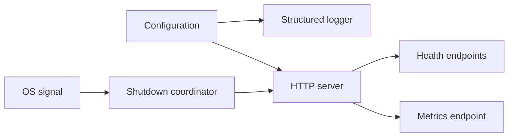

# M0 Bootstrap Foundation

## Status

`in design`

## Problem

MCPShield has no executable foundation yet. A future gateway cannot be started,
configured, health-checked, observed, or shut down safely until the repository has a
small Go application boundary and a durable local development contract.

The first slice must establish the operational shape without pretending that MCP
proxying, authentication, authorization, or persistence workflows already exist.

## Out of scope

| Excluded capability | Reason |
| --- | --- |
| MCP protocol handling or upstream proxying | Reserved for M1. |
| JWT, OIDC, RBAC, or policy evaluation | Reserved for later security slices. |
| PostgreSQL-backed domain tables or audit writes | M0 only establishes the migration and connection boundary if needed; no business persistence is required. |
| Kafka, Redis, OPA, AI, DLP, approvals, and frontend | Not required to prove the bootstrap foundation. |
| Kubernetes and production deployment manifests | Local executable behavior comes first. |

## Assumptions

| Assumption | Chosen default | Rationale | Confirmed? |
| --- | --- | --- | --- |
| Go toolchain | Go 1.27.x | Matches the portfolio baseline. | yes |
| HTTP router | `net/http` first | M0 needs no third-party routing behavior. | yes |
| Configuration source | environment variables with documented defaults | Keeps local startup simple and avoids committing secrets. | yes |
| Server shutdown | SIGINT and SIGTERM with bounded timeout | Required for predictable local and future container operation. | yes |
| Health contract | `/health/live`, `/health/ready`, `/metrics` | Matches the portfolio observability baseline. | yes |
| Persistence in M0 | no domain persistence; defer PostgreSQL wiring until a concrete record exists | Avoids an empty database abstraction and speculative schema. | yes |

**Open questions:** none for the M0 implementation boundary.

## Acceptance criteria

### M0-AC1 - Module and binaries

When a developer checks out the repository with Go 1.27.x installed, the project SHALL
contain a valid Go module and SHALL build the declared command binaries without external
services or credentials.

### M0-AC2 - Configuration validation

When the application starts with valid configuration, it SHALL expose the configured HTTP
address and timeout values. When a required value or typed value is invalid, the process
SHALL fail before serving requests and SHALL report the configuration field without
revealing secret values.

### M0-AC3 - Liveness

While the process is running, `GET /health/live` SHALL return HTTP 200 with a structured
JSON response indicating that the process is alive.

### M0-AC4 - Readiness

While the M0 dependencies are available, `GET /health/ready` SHALL return HTTP 200 with a
structured JSON response indicating readiness. When a required startup dependency is not
available, readiness SHALL return a non-200 response without causing liveness to fail.

### M0-AC5 - Metrics

While the process is running, `GET /metrics` SHALL return HTTP 200 in Prometheus text
format and SHALL include at least one MCPShield process or HTTP request metric.

### M0-AC6 - Structured logging

For startup, configuration failure, request completion, and shutdown events, the process
SHALL emit structured logs with an event name and SHALL NOT emit configured secret values.

### M0-AC7 - Request limits and timeout

When a request exceeds the configured body limit or server timeout, the HTTP boundary SHALL
reject or terminate it according to the documented contract and SHALL record the outcome in
logs or metrics without exposing request secrets.

### M0-AC8 - Graceful shutdown

When the process receives SIGINT or SIGTERM, it SHALL stop accepting new requests, allow
bounded in-flight work to finish within the shutdown timeout, close owned resources, and
exit successfully.

### M0-AC9 - Local development

The repository SHALL document the commands to build, run, test, race-test, vet, and validate
the local Docker Compose configuration. The M0 commands SHALL not require cloud credentials
or an AI provider key.

## Traceability

| Requirement | Primary proof |
| --- | --- |
| M0-AC1 | Build test and command smoke test |
| M0-AC2 | Configuration unit tests and invalid-startup test |
| M0-AC3 | HTTP handler test |
| M0-AC4 | Readiness handler tests for available/unavailable dependency state |
| M0-AC5 | Metrics endpoint test |
| M0-AC6 | Structured logger test with secret-redaction assertion |
| M0-AC7 | HTTP limit and timeout tests |
| M0-AC8 | Shutdown integration test with cancellation and deadline assertions |
| M0-AC9 | README/Makefile and Docker Compose validation |

## Observable outcomes

- A clean checkout builds and starts a documented M0 binary.
- Health and metrics endpoints have stable status codes and response shapes.
- Invalid configuration fails fast and safely.
- Shutdown is bounded and testable.
- The repository has repeatable local verification commands.

## Flow

1. Process starts -> configuration loader (new) validates environment values.
2. Configuration -> logger (new) and HTTP server (new).
3. HTTP server -> health handlers and metrics handler (new).
4. OS signal -> shutdown coordinator (new) cancels the server and closes owned resources.

## Relations

## Surface

| Surface | Decision | Landing |
| --- | --- | --- |
| `GET /health/live` | HTTP 200 JSON when process is alive | M0-AC3 |
| `GET /health/ready` | HTTP 200 when ready; non-200 when dependency state is unavailable | M0-AC4 |
| `GET /metrics` | Prometheus text response | M0-AC5 |
| process startup | fail fast on invalid configuration | M0-AC2 |
| process shutdown | bounded graceful shutdown on SIGINT/SIGTERM | M0-AC8 |

## Landing

| Door | Decision | Rejected alternative |
| --- | --- | --- |
| command entry point | one executable gateway binary in `cmd/gateway` | multiple binaries before a second process profile exists |
| configuration | typed application config owned by the internal app package | untyped environment lookups spread through handlers |
| persistence | no domain tables in M0 | speculative repository and ORM layer |
| HTTP | standard library server and handlers | framework-specific routing before a concrete routing need exists |

## Impact

| Area | Expected impact |
| --- | --- |
| Repository | Adds the first Go module, command entry point, internal packages, tests, and local run documentation. |
| Operations | Establishes health, metrics, logging, limits, timeout, and shutdown contracts. |
| Security | Establishes secret-safe configuration and logging defaults; does not provide authentication yet. |
| Future slices | M1 can add MCP transport behind the existing HTTP boundary without redefining process lifecycle. |

## Sources

- `codex-go-mcpshield-eventscope.md` - MCPShield M0 requirements and shared engineering baseline.
- `docs/engineering-workflow.md` - repository SDD and verification workflow.