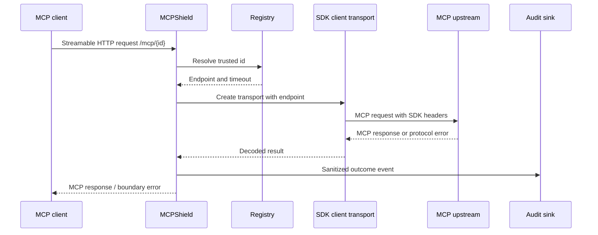

# M1 Remote MCP Proxy Design

## Context

M1 adds MCP protocol handling to the existing M0 HTTP process. The gateway must act as an
MCP client toward a trusted upstream while presenting a stable remote MCP endpoint to its
caller. The official SDK owns MCP framing and transport details; MCPShield owns routing,
timeouts, audit, and later enforcement hooks.

## Components

| Component | Responsibility | Boundary |
| --- | --- | --- |
| `internal/upstream` | Load immutable ID-to-endpoint registry and resolve enabled entries | Never accepts a target URL from request input. |
| `internal/mcpproxy` | Create SDK client transport, relay MCP operations, and close sessions | Does not decide authorization in M1. |
| `internal/audit` | Define sanitized proxy event and bounded in-memory sink | No raw auth headers or arguments in events. |
| `internal/httpapi` | Route `/mcp/{upstreamID}` through existing request controls | Remains responsible for request IDs and HTTP boundary errors. |
| `internal/observability` | Proxy counters, duration, and upstream failure metrics | Labels use bounded IDs, methods, and outcomes only. |

## Protocol baseline

- Dependency: `github.com/modelcontextprotocol/go-sdk` v1.7.0+.
- Remote transport: `mcp.StreamableClientTransport`.
- Primary protocol: MCP `2026-07-28`.
- The SDK manages JSON-RPC framing, Streamable HTTP session behavior, and protocol headers.
- The gateway must not implement a parallel JSON-RPC parser for normal proxy traffic.
- Stateless mode is preferred where the upstream transport and SDK options support it; any
  stateful session requirement must be explicit and bounded.

## Request lifecycle



## Upstream registry

M1 uses an immutable startup registry with fields:

```text
id
endpoint
enabled
timeout
protocol_version
```

Endpoint validation occurs at startup. The request path accepts only the registry ID. M1
does not resolve DNS or perform SSRF protection yet; that is a security hardening task
before arbitrary production endpoints are allowed.

## Error handling

- Unknown or disabled ID: structured 404/403-style gateway error, no outbound request.
- Invalid registry configuration: startup failure with field-scoped safe error.
- Upstream timeout: bounded 504-style gateway error and audit outcome `timeout`.
- Upstream connection failure: bounded 502-style gateway error and audit outcome `upstream_error`.
- MCP protocol error: preserve the protocol error body when safe; audit only classification
  and metadata, not raw arguments or authorization headers.
- Client cancellation: cancel the SDK operation and audit outcome `client_canceled`.

## Audit contract

```text
request_id
upstream_id
mcp_method
outcome
duration
protocol_version
timestamp
```

The in-memory sink is bounded and test-only for M1. A later PostgreSQL/outbox design will
replace the sink without changing the proxy use case contract.

## Security considerations

- No arbitrary URL forwarding.
- No credential forwarding in M1; upstream auth is explicitly deferred.
- No raw request body, bearer header, or tool argument in logs/audit.
- Request and upstream timeouts inherit the M0 lifecycle contract.
- SSRF controls are a known pre-production gap and must be resolved before accepting
  administrator-supplied external endpoints.

## Testing strategy

- Unit tests for registry lookup, disabled/unknown IDs, endpoint validation, and audit
  sanitization.
- Mock MCP upstream using the official SDK Streamable HTTP handler.
- End-to-end tests use `httptest` and an SDK client to exercise discovery and tool calls.
- Failure tests cover timeout, connection failure, malformed protocol response, cancellation,
  and arbitrary target rejection.
- Run `go test ./...`, `go test -race ./...`, `go vet ./...`, and `docker compose config`.

## Risks and mitigations

| Risk | Mitigation |
| --- | --- |
| SDK session semantics are misunderstood | Use official SDK transport and upstream examples; test real discovery. |
| Proxy leaks sensitive payloads | Keep audit metadata-only and add redaction assertions. |
| Registry becomes an SSRF bypass | Reject request URLs, validate configured endpoints, and track SSRF as a release gate. |
| Session resources leak on failures | Close SDK sessions in all paths and test cancellation/timeouts under race. |