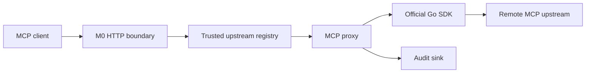

# M1 Remote MCP Reverse Proxy

## Status

`in design`

## Problem

MCPShield currently exposes only generic health and metrics endpoints. It cannot accept a
remote MCP request, resolve a trusted upstream, or relay a tool discovery/call through an
MCP-aware boundary. Without that vertical slice, later authentication and policy work has
no real protocol path to protect.

M1 introduces the first remote MCP path using the official Go SDK and the MCP
`2026-07-28` Streamable HTTP baseline. It proves transparent forwarding and audit
observability while deliberately leaving authorization decisions for later slices.

## Out of scope

| Excluded capability | Reason |
| --- | --- |
| JWT, OIDC, RBAC, scopes, or identity mapping | M2 owns authentication and identity. |
| Allow/deny policy, risk scoring, DLP, redaction, or approvals | M3+ owns enforcement. |
| Arbitrary client-provided upstream URLs | The proxy must resolve only trusted registry entries. |
| PostgreSQL-backed upstream CRUD or authoritative audit persistence | M1 uses an explicit in-memory/configured registry and audit sink boundary; durable storage is a later slice. |
| Legacy SSE as the primary transport | Streamable HTTP is the M1 baseline; compatibility is a later decision. |
| Tool argument transformation | Transparent relay comes before inspection and transformation. |

## Assumptions

| Assumption | Chosen default | Rationale | Confirmed? |
| --- | --- | --- | --- |
| SDK | `github.com/modelcontextprotocol/go-sdk` v1.7.0 or newer | This line supports MCP `2026-07-28`. | yes |
| Remote transport | Streamable HTTP | It is the current remote transport supported by the SDK. | yes |
| Gateway route | `/mcp/{upstreamID}` | The upstream ID is resolved from trusted configuration. | yes |
| Registry | immutable startup registry from configuration | Avoids speculative database CRUD before persistence is designed. | yes |
| Proxy mode | stateless where the upstream supports it | Preserves horizontal scaling and per-request routing. | yes |
| Audit | bounded in-process audit sink with structured events | Establishes the contract without losing the future persistence boundary. | yes |

**Open questions:** none for the M1 implementation boundary.

## Acceptance criteria

### M1-AC1 - Trusted upstream resolution

When a request targets `/mcp/{upstreamID}`, the gateway SHALL resolve the ID only from
the configured registry and SHALL reject unknown or disabled IDs without making an outbound
request.

### M1-AC2 - No arbitrary proxy target

When a caller supplies an upstream URL or path not represented by a configured registry
entry, the gateway SHALL not use that value as an outbound destination.

### M1-AC3 - MCP Streamable HTTP connection

Given a configured reachable MCP upstream supporting Streamable HTTP, the gateway SHALL
connect using `mcp.StreamableClientTransport` and the negotiated MCP `2026-07-28` baseline.

### M1-AC4 - Discovery relay

When an MCP client requests tool discovery through the gateway, the gateway SHALL return the
upstream tool metadata without changing tool names or schemas.

### M1-AC5 - Tool call relay

When an MCP client calls a tool through the gateway, the gateway SHALL forward the method
and arguments to the selected upstream and SHALL return the upstream result or structured
protocol error to the caller.

### M1-AC6 - Protocol header integrity

For MCP `2026-07-28` requests, the gateway SHALL preserve or derive the SDK-managed
protocol metadata and SHALL reject an inconsistent method/name header rather than silently
forwarding a contradictory request.

### M1-AC7 - Timeouts and cancellation

When the inbound request context is canceled or the configured upstream timeout expires,
the gateway SHALL cancel the outbound MCP operation and SHALL return a bounded error without
leaking an active upstream session.

### M1-AC8 - Audit event

For accepted, rejected, and failed proxy attempts, the gateway SHALL emit a structured audit
event containing request ID, upstream ID, MCP method, outcome, and duration, while excluding
raw authorization headers and tool argument secrets.

### M1-AC9 - Integration proof

The repository SHALL include an in-process mock MCP upstream and an integration test proving
client -> MCPShield -> mock upstream for discovery, tool call, unknown upstream, and upstream
failure cases.

## Traceability

| Requirement | Primary proof |
| --- | --- |
| M1-AC1 | Registry resolution unit and HTTP integration tests |
| M1-AC2 | Arbitrary-target rejection test and outbound-request spy |
| M1-AC3 | SDK client transport integration test pinned to `2026-07-28` |
| M1-AC4 | Mock upstream discovery relay assertion |
| M1-AC5 | Mock tool call with argument/result assertion |
| M1-AC6 | Protocol header mismatch test |
| M1-AC7 | Cancellation and timeout integration tests |
| M1-AC8 | In-memory audit sink assertions |
| M1-AC9 | End-to-end mock upstream suite |

## Observable outcomes

- A configured MCP upstream can be reached through a stable gateway route.
- An unknown upstream ID is rejected without outbound network activity.
- Tool discovery and calls work through the gateway with protocol metadata intact.
- Timeout, cancellation, rejection, and success outcomes are auditable.
- No caller-controlled URL becomes a proxy destination.

## Flow

1. MCP client request -> M0 HTTP boundary (exists) with request ID and limits.
2. `/mcp/{upstreamID}` -> trusted registry (new) resolves immutable upstream metadata.
3. Registry result -> MCP proxy (new) creates an SDK Streamable HTTP client transport.
4. MCP proxy -> configured upstream MCP server and relays the response.
5. Proxy outcome -> audit sink (new) emits a sanitized event.

## Relations

## Surface

| Surface | Decision | Landing |
| --- | --- | --- |
| `POST /mcp/{upstreamID}` | Relay MCP request to configured upstream | M1-AC3, M1-AC5 |
| `GET /mcp/{upstreamID}` | Support SDK-required Streamable HTTP session behavior | M1-AC3 |
| unknown `{upstreamID}` | Structured 404/4xx without outbound call | M1-AC1 |
| upstream timeout/failure | Structured 502/504 boundary error and audit event | M1-AC7, M1-AC8 |
| audit event | Sanitized in-process event | M1-AC8 |

## Landing

| Door | Decision | Rejected alternative |
| --- | --- | --- |
| SDK integration | use official `mcp.StreamableClientTransport` | custom MCP JSON-RPC implementation |
| target selection | immutable configured ID-to-endpoint registry | caller-provided URL proxying |
| audit boundary | interface plus in-memory implementation | direct logging only with no durable seam |
| proxy state | stateless gateway path where transport allows it | sticky sessions as a default requirement |

## Impact

| Area | Expected impact |
| --- | --- |
| Dependencies | Add official MCP Go SDK v1.7.0+ and its transitive dependencies. |
| HTTP | Add `/mcp/{upstreamID}` routing behind existing M0 middleware. |
| Security | Establish trusted destination selection and sanitized audit behavior before auth/policy. |
| Operations | Add proxy outcome, upstream latency, and failure metrics. |
| Future slices | M2 can attach identity and M3 can evaluate policy at the proxy decision boundary. |

## Sources

- `codex-go-mcpshield-eventscope.md` - MCPShield M1 requirements and pipeline ordering.
- Official SDK compatibility: `https://github.com/modelcontextprotocol/go-sdk`.
- Official SDK Streamable HTTP client: `mcp.StreamableClientTransport`.
- `docs/progress.md` - current project handoff.