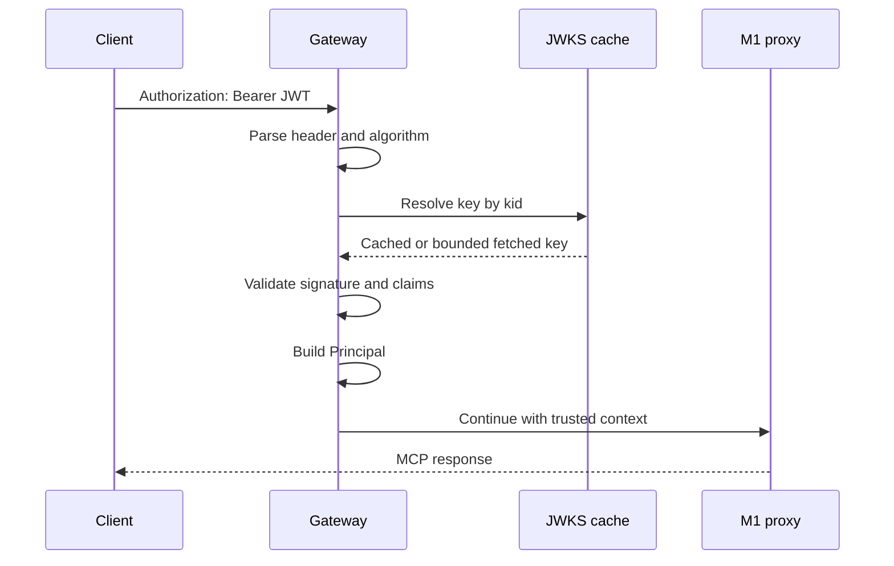

# M2 Authentication and Identity Design

## Context

Authentication belongs at the HTTP edge before MCP inspection and proxying. The validator must be deterministic, bounded, and independent of policy evaluation. It exposes a small internal principal contract so M3 can evaluate authorization without depending on a JWT library or provider-specific claims.

## Components

| Component | Responsibility | Boundary |
| --- | --- | --- |
| `internal/auth` | Extract bearer tokens, validate JWTs, classify failures | Does not authorize tools. |
| `internal/jwks` | Fetch, cache, rotate, and expire public keys | Uses bounded HTTP and explicit issuer configuration. |
| `internal/identity` | Map validated claims to immutable principal | Does not read raw headers. |
| `internal/httpapi` | Apply auth middleware to protected MCP routes | Keeps generic 401 response contract. |
| `internal/audit` | Record sanitized auth outcomes | Never stores tokens or raw claims. |

## Principal contract

```text
Subject
TenantID
ClientID
AgentID
Roles
Scopes
Issuer
AuthenticationMethod
AuthenticatedAt
```

The principal is immutable after construction. Missing optional claims remain empty; missing required claims fail validation when configured as required.

## Validation sequence



## Configuration

Required in production mode:

```text
MCP_SHIELD_OIDC_ISSUER
MCP_SHIELD_OIDC_AUDIENCE
MCP_SHIELD_OIDC_JWKS_URL
```

Optional:

```text
MCP_SHIELD_JWKS_CACHE_TTL
MCP_SHIELD_AUTH_TIMEOUT
MCP_SHIELD_DEV_TOKEN
MCP_SHIELD_AUTH_REQUIRED
```

Development token mode must be explicit, disabled by default, and rejected when production mode is enabled.

## Failure handling

- Missing or malformed bearer: 401 `authentication_required`.
- Invalid signature/claims: 401 `authentication_failed`.
- JWKS timeout/unavailability: fail closed; the external response must not reveal key details.
- Unexpected validator/configuration failure: sanitized internal error and no proxy call.

## Security considerations

- Accept only the `Authorization` header; never trust inbound `X-Subject`, `X-Tenant-ID`, or similar headers.
- Allowlist signing algorithms; reject `none` and unexpected key types.
- Validate issuer, audience, expiration, not-before, and key ID.
- Do not log the token, JWT payload, authorization header, or full claims map.
- Use a bounded JWKS HTTP client and protect refresh from stampedes.
- Fail closed when a signing key cannot be resolved.

## Testing strategy

- Unit tests use generated RSA/EC keys and deterministic signed tokens.
- `httptest` JWKS server covers cache hits, rotation, delay, malformed response, and outage.
- HTTP integration tests verify no upstream request occurs on authentication failure.
- Race tests cover concurrent key refresh and concurrent request validation.
- Existing M0/M1 gates remain mandatory.

## Risks and mitigations

| Risk | Mitigation |
| --- | --- |
| Clock skew causes false rejection | Configurable small leeway with explicit tests. |
| JWKS refresh stampede | Singleflight or equivalent bounded refresh coordination. |
| Claim naming differs by issuer | Explicit claim mapping configuration, never broad fallback. |
| Dev mode leaks into production | Fail startup when development token mode conflicts with production settings. |
