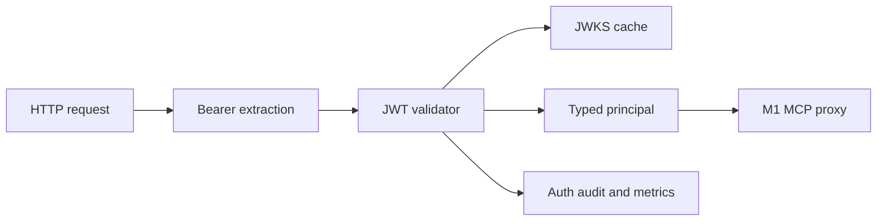

# M2 Authentication and Identity

## Status

`in design`

## Problem

MCPShield currently accepts remote MCP traffic without establishing who the caller is. The proxy can select a trusted upstream, but it cannot distinguish users, agents, tenants, or clients. Policy decisions would therefore have no trustworthy principal to evaluate.

M2 adds bearer-token authentication and an internal identity model at the gateway edge. Authentication failures stop before MCP proxying, while successful identity data is passed inward as a typed principal without trusting arbitrary forwarded identity headers.

## Out of scope

| Excluded capability | Reason |
| --- | --- |
| Tool allow/deny policies and default-deny authorization | M3 consumes the authenticated principal. |
| Risk scoring, DLP, approvals, and AI | Later enforcement and advisory phases. |
| Upstream credential forwarding | Requires a separate secret and delegation design. |
| Refresh-token handling or login UI | MCPShield validates access tokens; it is not an identity provider. |
| API keys and mTLS | Future authentication adapters. |
| Multi-tenant administration UI | M2 establishes tenant claims and boundaries only. |

## Assumptions

| Assumption | Chosen default | Rationale | Confirmed? |
| --- | --- | --- | --- |
| Token format | JWT bearer token | Matches the project baseline. | yes |
| Trust configuration | issuer, audience, and JWKS URL are explicit | Prevents arbitrary issuer trust. | yes |
| Key retrieval | bounded HTTP client with cache | JWKS must not block requests indefinitely. | yes |
| Identity source | validated token claims only | Forwarded identity headers are untrusted. | yes |
| Missing token | reject protected MCP routes with 401 | Secure default. | yes |
| Local development | explicit development token mode | Keeps demos usable without weakening production defaults. | yes |

**Open questions:** none for the M2 implementation boundary.

## Acceptance criteria

### M2-AC1 - Bearer extraction

When a protected MCP request has no `Authorization: Bearer <token>` header, the gateway SHALL reject it with HTTP 401 before contacting an upstream.

### M2-AC2 - JWT signature validation

When a bearer token has an invalid signature, unsupported algorithm, malformed structure, or unknown key ID, the gateway SHALL reject it with HTTP 401 without revealing validation internals.

### M2-AC3 - Issuer, audience, and time claims

When issuer, audience, expiration, or not-before claims do not satisfy configured validation, the gateway SHALL reject the token with HTTP 401.

### M2-AC4 - JWKS retrieval and caching

When a configured JWKS endpoint is reachable, the gateway SHALL retrieve keys with a bounded timeout, cache successful keys for a configured duration, and avoid an unbounded request-path refresh loop.

### M2-AC5 - Principal construction

When validation succeeds, the gateway SHALL construct a typed principal containing subject, tenant, client, agent, roles, scopes, issuer, and authentication method where claims exist.

### M2-AC6 - Trusted identity boundary

The gateway SHALL ignore or overwrite inbound identity headers and SHALL derive downstream identity context only from validated token claims.

### M2-AC7 - Proxy integration

When authentication succeeds, the gateway SHALL allow the request to reach the existing M1 MCP route with the principal available to later policy middleware.

### M2-AC8 - Authentication audit and metrics

The gateway SHALL emit sanitized authentication success/failure outcomes and metrics without logging bearer tokens, raw JWTs, or secret claims.

### M2-AC9 - Failure isolation

When the identity provider or JWKS endpoint is unavailable, the gateway SHALL fail closed for tokens requiring unavailable keys and SHALL keep liveness independent from that failure.

## Traceability

| Requirement | Primary proof |
| --- | --- |
| M2-AC1 | Missing/malformed Authorization integration tests |
| M2-AC2 | Invalid signature, algorithm, and key ID tests |
| M2-AC3 | Issuer, audience, expiry, and not-before tests |
| M2-AC4 | JWKS cache, timeout, and rotation tests |
| M2-AC5 | Principal claim mapping tests |
| M2-AC6 | Spoofed identity-header integration test |
| M2-AC7 | Authenticated request reaches M1 route test |
| M2-AC8 | Sanitized audit and metric assertions |
| M2-AC9 | JWKS outage and liveness integration tests |

## Observable outcomes

- Unauthenticated MCP calls stop before outbound proxying.
- Valid tokens produce a typed principal available to policy middleware.
- Invalid or wrongly scoped tokens fail closed with stable 401 responses.
- JWKS retrieval is bounded and cached.
- Tokens and sensitive claims never appear in logs or audit events.

## Flow

1. HTTP request -> M0 request boundary (exists).
2. Authorization header -> authentication middleware (new) extracts bearer token.
3. Token -> JWT validator (new) checks signature, issuer, audience, and time claims.
4. Valid claims -> principal mapper (new) creates typed identity context.
5. Principal -> M1 MCP proxy (exists), ready for M3 policy evaluation.
6. Outcome -> audit/metrics (new) records sanitized authentication result.

## Relations

## Surface

| Surface | Decision | Landing |
| --- | --- | --- |
| protected `/mcp/{upstreamID}` | Require bearer authentication | M2-AC1, M2-AC7 |
| missing/invalid token | HTTP 401 with generic error | M2-AC1, M2-AC2, M2-AC3 |
| valid token | Principal context for downstream policy | M2-AC5, M2-AC7 |
| JWKS unavailable | Fail closed; liveness remains available | M2-AC4, M2-AC9 |
| identity headers | Ignore inbound values | M2-AC6 |

## Landing

| Door | Decision | Rejected alternative |
| --- | --- | --- |
| validation | focused maintained JWT/OIDC adapter | hand-rolled cryptographic verification |
| principal transport | request context with typed internal value | mutable global identity state |
| error contract | generic 401 plus internal classification | raw validator errors to clients |
| default | fail closed on protected routes | anonymous pass-through |

## Impact

| Area | Expected impact |
| --- | --- |
| Configuration | Adds issuer, audience, JWKS, cache, and development-mode validation. |
| HTTP | Adds authentication middleware before `/mcp/` routing. |
| Security | Establishes the trusted principal boundary required by authorization. |
| Operations | Adds authentication outcome counters, latency, and JWKS health signals. |
| Future slices | M3 consumes the principal without reimplementing token parsing. |

## Sources

- `codex-go-mcpshield-eventscope.md` - MCPShield authentication and identity baseline.
- `docs/progress.md` - M1 handoff and M2 scope.
