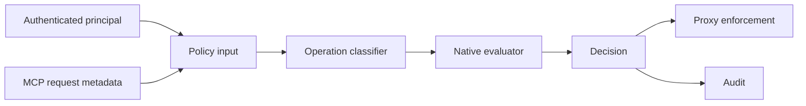

# M3 Native Policy Engine

## Status

`in design`

## Problem

MCPShield now knows the caller identity and can proxy MCP tools, but every authenticated request is still forwarded. The gateway has no deterministic authorization boundary, so a valid token can reach any configured tool.

M3 introduces a native policy engine with default deny, operation classification, argument-aware matching, explicit decisions, and simulation. Policy evaluation is deterministic and independent of AI.

## Out of scope

| Excluded capability | Reason |
| --- | --- |
| OPA/Rego | M7 follows after native semantics stabilize. |
| Risk scoring and DLP | M4-M5 add signals and transformations. |
| Human approval | M6 consumes `REQUIRE_APPROVAL`. |
| Policy persistence/version CRUD | M3 uses immutable startup policy configuration. |
| AI authorization | AI is never the final authorizer. |

## Assumptions

| Assumption | Chosen default | Rationale | Confirmed? |
| --- | --- | --- | --- |
| Default behavior | deny | Secure failure mode. | yes |
| Policy source | validated YAML or equivalent startup configuration | Avoids mutable policy state before persistence is designed. | yes |
| Match dimensions | principal, tenant, upstream, method, tool, operation class, arguments | Matches the MCPShield authorization model. | yes |
| Decision set | ALLOW, DENY, REQUIRE_APPROVAL, ALLOW_WITH_REDACTION, ALLOW_WITH_LIMITS | Preserves future enforcement outcomes. | yes |
| Unknown operation | conservative classification and deny unless explicitly allowed | Tool names alone are insufficient. | yes |

**Open questions:** none for M3.

## Acceptance criteria

### M3-AC1 - Deterministic decisions

Given the same principal, MCP request, policy set, and context, the engine SHALL return the same decision, matched policy IDs, and reason without network or model calls.

### M3-AC2 - Default deny

When no policy matches an authenticated MCP request, the engine SHALL return `DENY` and the proxy SHALL not invoke the upstream tool.

### M3-AC3 - Multi-dimensional matching

The engine SHALL match configured subject roles, tenant, upstream, method, tool pattern, operation class, and argument constraints when those dimensions are present.

### M3-AC4 - Precedence and conflict handling

When multiple policies match, the engine SHALL apply documented precedence and SHALL resolve conflicting decisions deterministically.

### M3-AC5 - Operation classification

The engine SHALL classify discovery, read, write, execution, admin, and unknown operations using registry metadata with conservative fallback.

### M3-AC6 - Explicit outcomes

The engine SHALL expose ALLOW, DENY, REQUIRE_APPROVAL, ALLOW_WITH_REDACTION, and ALLOW_WITH_LIMITS without embedding OPA or HTTP-specific types.

### M3-AC7 - Proxy enforcement

The MCP proxy SHALL evaluate policy before forwarding a tool call and SHALL audit denied and allowed outcomes.

### M3-AC8 - Policy simulation

A simulation path SHALL evaluate a request against a candidate policy set without invoking an upstream or mutating active policy state.

### M3-AC9 - Configuration validation

Invalid patterns, duplicate IDs, missing decisions, and contradictory precedence SHALL fail before serving requests.

## Traceability

| Requirement | Primary proof |
| --- | --- |
| M3-AC1 | Pure evaluator table tests |
| M3-AC2 | No-match proxy test with outbound spy |
| M3-AC3 | Role/tenant/tool/argument matcher tests |
| M3-AC4 | Precedence and conflict table tests |
| M3-AC5 | Classifier tests for all operation classes |
| M3-AC6 | Decision model contract tests |
| M3-AC7 | Proxy allow/deny integration tests and audit assertions |
| M3-AC8 | Simulation test proving no upstream call/state mutation |
| M3-AC9 | Policy loader validation tests |

## Observable outcomes

- Authenticated requests without an explicit match are denied.
- Allowed requests reach the upstream only after deterministic evaluation.
- Approval and transformation outcomes are represented without pretending they are already executed.
- Simulation is side-effect free.
- Policy errors fail at startup rather than silently broadening access.

## Flow

1. Authenticated request -> policy input builder (new).
2. Principal and MCP metadata -> operation classifier (new).
3. Classified input -> native evaluator (new).
4. Decision -> proxy enforcement (new) or audit/simulation result.

## Relations

## Surface

| Surface | Decision | Landing |
| --- | --- | --- |
| authenticated MCP tool call | Evaluate before upstream forwarding | M3-AC2, M3-AC7 |
| no matching policy | DENY | M3-AC2 |
| policy simulation | Return decision without upstream call | M3-AC8 |
| invalid policy configuration | Fail startup | M3-AC9 |

## Landing

| Door | Decision | Rejected alternative |
| --- | --- | --- |
| evaluator | pure Go function over typed input | model/API call during authorization |
| default | deny | permissive fallback |
| policy loading | immutable compiled rules | per-request YAML parsing |
| precedence | explicit priority, then deny-wins tie break | order-dependent map iteration |

## Impact

| Area | Expected impact |
| --- | --- |
| Security | Adds the first authorization enforcement boundary. |
| Proxy | Tool calls are evaluated before upstream invocation. |
| Configuration | Adds validated policy rules and operation metadata. |
| Future slices | M4 can add risk signals without changing the decision contract. |

## Sources

- `codex-go-mcpshield-eventscope.md` - native policy and decision requirements.
- `.specs/features/m2-authentication/` - trusted principal contract.
