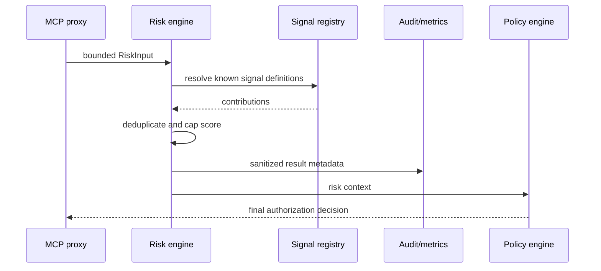

# M4 Deterministic Risk Engine Design

## Context

Risk is a signal-producing layer between MCP inspection and policy evaluation. It must be cheap, deterministic, bounded, and explainable. The engine does not read the network, call an AI provider, or decide authorization.

## Core types

```text
RiskInput
RiskSignal
RiskResult
Severity
SignalDefinition
```

`RiskResult` contains score, severity, ordered signals, contributions, and a sanitized explanation. It never contains raw bearer tokens or complete tool arguments.

## Baseline contribution table

| Signal | Default points | Notes |
| --- | ---: | --- |
| `write_operation` | 20 | Mutating tool classification. |
| `execution_operation` | 35 | Shell/process-like execution. |
| `production_environment` | 25 | Explicit environment metadata. |
| `external_url` | 15 | URL metadata, not raw URL logging. |
| `privileged_operation` | 30 | Admin/privileged classification. |
| `unseen_tool` | 10 | Tool not present in trusted registry history. |
| `high_frequency` | 10 | Caller/tool rate signal supplied by bounded context. |
| `cross_tenant_target` | 35 | Target tenant differs from principal tenant. |

Scores are capped at 100 and duplicate signal IDs count once.

## Severity

```text
0-29    LOW
30-59   MEDIUM
60-79   HIGH
80-100  CRITICAL
```

## Evaluation sequence



## Boundaries

- Signal IDs are defined by the application, not accepted as arbitrary numeric values from callers.
- Maximum signal count and metadata lengths are validated before evaluation.
- Explanations use signal IDs and labels, never raw argument values.
- Unknown signals fail validation in strict mode.
- Policy remains authoritative: a risk result cannot turn DENY into ALLOW.

## Testing strategy

- Table-driven contribution and severity boundary tests.
- Repeated evaluation and duplicate signal tests.
- All-signal score cap test.
- Input bound and malformed signal tests.
- Policy integration proving risk is advisory.
- Audit/metric tests for redaction and bounded labels.
- Race test for immutable shared signal registry.

## Risks and mitigations

| Risk | Mitigation |
| --- | --- |
| Point values become accidental policy | Version the contribution table and document changes. |
| Signal context is spoofed | Populate signals from trusted gateway observations and registry metadata. |
| High score bypasses deny | Test policy DENY with CRITICAL risk. |
| Metric cardinality grows | Use fixed signal IDs and severity labels only. |
| Future ML score disagrees | Keep ML advisory and behind an explicit adapter. |
