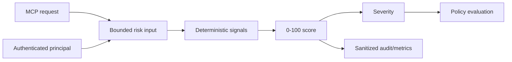

# M4 Deterministic Risk Engine

## Status

`in design`

## Problem

MCPShield now authenticates callers and evaluates explicit authorization policies, but policy evaluation has no normalized risk signal. Operators cannot distinguish a low-risk read from a high-risk production mutation when reviewing decisions or defining approval thresholds.

M4 adds a deterministic risk engine that produces explainable signals, a bounded score from 0 to 100, and a severity. Risk informs policy and audit; it never grants permission and never replaces authorization.

## Out of scope

| Excluded capability | Reason |
| --- | --- |
| AI-generated risk decisions | Risk must remain deterministic and auditable. |
| Human approval workflow | M6 consumes high-risk decisions. |
| Secret/PII detection | M5 adds DLP signals; M4 accepts explicit precomputed signals only. |
| Full SSRF/filesystem/shell enforcement | M5 owns specialized controls. |
| Historical anomaly detection | Requires durable event history and later analytics. |
| Dynamic model-trained scoring | Not appropriate before deterministic baseline is proven. |

## Assumptions

| Assumption | Chosen default | Rationale | Confirmed? |
| --- | --- | --- | --- |
| Score range | 0-100 | Matches the portfolio baseline. | yes |
| Severity | LOW 0-29, MEDIUM 30-59, HIGH 60-79, CRITICAL 80-100 | Stable operational thresholds. | yes |
| Scoring | additive capped contributions with deterministic deduplication | Explainable and easy to test. | yes |
| Unknown tool | risk signal plus conservative operation classification | Unknown must not silently look safe. | yes |
| Authorization relationship | policy decision remains authoritative | Risk cannot grant access. | yes |
| Input size | bounded strings, argument metadata, and configured signal list | Prevents unbounded work and labels. | yes |

**Open questions:** none for M4.

## Acceptance criteria

### M4-AC1 - Deterministic scoring

Given identical risk input, the engine SHALL return the same score, severity, signals, and explanation without network, storage, or model calls.

### M4-AC2 - Bounded score

The engine SHALL return an integer score between 0 and 100 inclusive, even when all configured signals are present.

### M4-AC3 - Baseline signals

The engine SHALL support deterministic signals for write operation, execution operation, production environment, external URL, privileged operation, unseen tool, high frequency, and cross-tenant target.

### M4-AC4 - Severity mapping

The engine SHALL map scores to LOW, MEDIUM, HIGH, and CRITICAL using the documented thresholds.

### M4-AC5 - Explainability

The result SHALL include stable signal IDs, individual contributions, total score, severity, and a human-readable explanation without raw secrets or full arguments.

### M4-AC6 - Duplicate and unknown handling

Repeated identical signals SHALL contribute once per evaluation, and unknown signal IDs SHALL be rejected or explicitly classified rather than silently ignored.

### M4-AC7 - Policy integration

The policy input or evaluation context SHALL be able to consume the risk result, while authorization remains the final ALLOW/DENY authority.

### M4-AC8 - Audit and metrics

Risk evaluation SHALL emit bounded metrics and sanitized audit metadata for score, severity, and signal IDs without logging raw arguments or credentials.

### M4-AC9 - Abuse and resource limits

The engine SHALL bound signal count, text lengths, and evaluation work, returning a safe error for oversized or malformed input.

## Traceability

| Requirement | Primary proof |
| --- | --- |
| M4-AC1 | Table-driven repeatability tests |
| M4-AC2 | All-signals cap test |
| M4-AC3 | One test per baseline signal |
| M4-AC4 | Boundary tests at 29/30/59/60/79/80/100 |
| M4-AC5 | Result and redaction assertions |
| M4-AC6 | Duplicate/unknown signal tests |
| M4-AC7 | Policy context integration test proving risk cannot allow a denied request |
| M4-AC8 | Audit/metrics assertions |
| M4-AC9 | Oversized input and bounded-work tests |

## Observable outcomes

- Identical requests produce identical explainable risk results.
- High-risk signals are visible to policy and audit without authorizing themselves.
- Scores never exceed 100 or become negative.
- Raw arguments and secrets never enter risk logs or metric labels.
- Malformed or oversized risk inputs fail safely.

## Flow

1. Authenticated principal, MCP metadata, environment, and bounded signal context -> risk input.
2. Risk input -> deterministic signal evaluator.
3. Signals -> capped score and severity.
4. Risk result -> policy context and sanitized audit event.
5. Policy -> final authorization decision.

## Relations

## Surface

| Surface | Decision | Landing |
| --- | --- | --- |
| tool-call evaluation | Produce risk result before policy decision | M4-AC1, M4-AC7 |
| high-risk operation | Expose HIGH/CRITICAL and signals to policy | M4-AC3, M4-AC4 |
| risk audit | Store score/severity/signal IDs only | M4-AC5, M4-AC8 |
| oversized input | Return safe bounded error | M4-AC9 |

## Landing

| Door | Decision | Rejected alternative |
| --- | --- | --- |
| scoring | additive deterministic contributions | model/API score at authorization time |
| risk authority | advisory input to policy | risk directly grants ALLOW |
| signal registry | immutable known signal definitions | arbitrary client-provided score |
| output | typed result with explanations | raw arguments in logs |

## Impact

| Area | Expected impact |
| --- | --- |
| Policy | Adds risk context without changing authorization ownership. |
| Proxy | Evaluates bounded risk before tool forwarding. |
| Operations | Adds score, severity, and signal metrics. |
| Security | Creates a deterministic basis for future approval and DLP workflows. |

## Sources

- `codex-go-mcpshield-eventscope.md` - MCPShield risk engine requirements.
- `.specs/features/m3-policy-engine/` - policy and decision contract.
- `.specs/features/m2-authentication/` - trusted principal contract.
