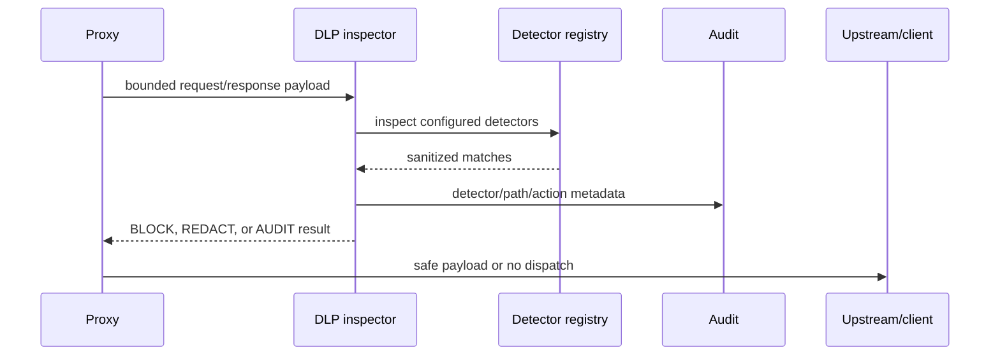

# M5 DLP and Secret Detection Design

## Context

DLP runs on bounded payloads at the proxy boundary. It must preserve privacy by default: detectors return metadata, not matched values, and audit/metrics use fixed identifiers. Request inspection happens before upstream dispatch; response inspection happens before client delivery.

## Core types

```text
Action: BLOCK | REDACT | AUDIT
InspectionInput
Match
InspectionResult
Detector
```

`Match` contains detector ID, field path, action, and optional non-reversible fingerprint. It never contains the matched value.

## Baseline detectors

| Detector ID | Detection basis | Default action |
| --- | --- | --- |
| `aws_access_key` | Access-key pattern | BLOCK |
| `jwt_like` | Three-part JWT-shaped value | REDACT |
| `github_token` | GitHub token prefix/pattern | BLOCK |
| `bearer_token` | Bearer credential field/value | BLOCK |
| `private_key_header` | PEM private-key header | BLOCK |
| `api_key_field` | Key/token/secret field names | REDACT |
| `password_field` | Password/passphrase field names | REDACT |

Synthetic fixtures are used in tests. The implementation must not claim complete provider coverage.

## Inspection sequence



## Bounds

- Maximum payload bytes are configured and enforced before parsing.
- Maximum nesting depth and match count are fixed.
- Field paths are normalized and length-limited.
- Invalid JSON is a safe inspection error; a block-capable request fails closed.
- Regexes are immutable and reviewed; no user-supplied regex executes in the request path.

## Redaction

Decode JSON into bounded generic values, recursively inspect strings and field names, replace matched values with `[REDACTED]`, and marshal the result. On decode/marshal failure, do not return partially transformed data.

## Enforcement

M5 introduces an inspector interface consumed by the proxy. BLOCK returns a generic protocol-safe error and prevents upstream invocation. REDACT forwards only the transformed payload. AUDIT forwards the original payload but never records it in logs/audit.

## Testing strategy

- Unit tests for each baseline detector and false-positive boundaries.
- JSON path tests for nested objects and arrays.
- Redaction round-trip tests proving valid structure and no original secret.
- Proxy tests proving BLOCK prevents outbound calls.
- Response tests proving REDACT occurs before client delivery.
- Bounds tests for payload size, depth, match count, malformed JSON, and regex behavior.
- Race tests for immutable detector registry.

## Risks and mitigations

| Risk | Mitigation |
| --- | --- |
| False positives break legitimate values | Make actions configurable and test safe boundaries. |
| False negatives create false confidence | Document pattern limitations and residual risk. |
| Regex performance degradation | Immutable bounded patterns and input caps. |
| Redaction alters tool schema | Preserve structure and test round trips. |
| Audit leaks secrets | Metadata-only event contract and no raw payload fields. |
