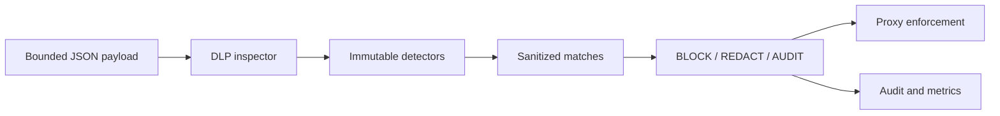

# M5 DLP and Secret Detection

## Status

`in design`

## Problem

MCPShield now authenticates callers, evaluates policy, and computes deterministic risk, but tool arguments and results can still contain bearer tokens, API keys, private keys, passwords, PII, or other secret-like values. Logging or forwarding these values without inspection creates an exfiltration and audit-leak risk.

M5 adds deterministic, metadata-first DLP inspection with secret detection, redaction, and blocking decisions. Detectors are advisory to policy unless an explicit enforcement action is configured; detection never grants authorization.

## Out of scope

| Excluded capability | Reason |
| --- | --- |
| Complete enterprise DLP or compliance classification | Pattern matching is a bounded baseline, not a full DLP product. |
| AI-based detection | Deterministic privacy-preserving behavior comes first. |
| Full PII/CPF/credit-card compliance engine | Add focused detectors only after the baseline is proven. |
| SSRF, filesystem, and shell sandbox enforcement | These are specialized controls layered after DLP. |
| Persisting raw payloads for forensic analysis | Metadata-first privacy boundary. |

## Assumptions

| Assumption | Chosen default | Rationale | Confirmed? |
| --- | --- | --- | --- |
| Inspection input | bounded JSON bytes and response metadata | Prevents unbounded parsing and memory use. | yes |
| Detector result | detector ID, field path, action, fingerprint optional | Auditability without secret storage. | yes |
| Secret actions | BLOCK, REDACT, AUDIT | Explicit enforcement outcomes. | yes |
| Redaction | preserve structure, replace matched value | Allows safe downstream use where policy permits. | yes |
| Logging | never log raw matched values | Non-negotiable privacy rule. | yes |
| Detector registry | immutable application-owned definitions | Prevents arbitrary caller-supplied patterns. | yes |

**Open questions:** none for the first M5 slice.

## Acceptance criteria

### M5-AC1 - Secret detection

The detector SHALL identify configured patterns for AWS access keys, JWT-like values, GitHub tokens, bearer tokens, private-key headers, API-key fields, and password-like field names without returning the matched secret.

### M5-AC2 - Field-path reporting

Each match SHALL report a stable detector ID and bounded JSON field path, while excluding the raw value and full payload from the result.

### M5-AC3 - Actions

The DLP engine SHALL support BLOCK, REDACT, and AUDIT actions and SHALL apply the configured action deterministically.

### M5-AC4 - Structural redaction

When redaction is selected, the engine SHALL preserve valid JSON structure and replace matched values with a fixed redaction marker.

### M5-AC5 - Request enforcement

When a configured detector returns BLOCK for a tool request, the proxy SHALL not invoke the upstream and SHALL emit a sanitized audit event.

### M5-AC6 - Response inspection

The response inspection path SHALL be able to redact or block secret-like output before it reaches the MCP client, without logging raw output.

### M5-AC7 - Bounds and failure mode

The engine SHALL bound payload size, nesting/depth, match count, and field-path length; malformed or oversized input SHALL fail closed for BLOCK-capable paths.

### M5-AC8 - Metrics and audit

DLP events SHALL expose fixed detector/action counters and sanitized audit metadata without secret values or high-cardinality payload labels.

### M5-AC9 - Honest scope

Documentation SHALL state that deterministic pattern matching is not complete enterprise DLP and SHALL identify false-positive/false-negative residual risk.

## Traceability

| Requirement | Primary proof |
| --- | --- |
| M5-AC1 | Detector table tests with synthetic secrets |
| M5-AC2 | Field-path and no-raw-value assertions |
| M5-AC3 | Action matrix tests |
| M5-AC4 | JSON redaction round-trip tests |
| M5-AC5 | Proxy block/no-outbound test |
| M5-AC6 | Response inspection integration test |
| M5-AC7 | Size, depth, match-count, and malformed-input tests |
| M5-AC8 | Fixed metric and audit assertions |
| M5-AC9 | README/security documentation review |

## Observable outcomes

- Synthetic secrets are detected without being returned or logged.
- Redacted JSON remains valid and structurally equivalent.
- Blocked requests never reach an upstream.
- DLP audit data contains detector/action/path metadata only.
- Oversized or malformed inspection input fails safely.

## Flow

1. MCP request/response bytes -> bounded DLP inspector.
2. Inspector -> detector registry and match set.
3. Match set -> configured action: BLOCK, REDACT, or AUDIT.
4. Action -> proxy enforcement and sanitized audit/metrics.

## Relations

## Surface

| Surface | Decision | Landing |
| --- | --- | --- |
| tool request | Inspect before upstream dispatch | M5-AC1, M5-AC5 |
| tool response | Inspect before client delivery | M5-AC6 |
| secret match | Apply configured action | M5-AC3 |
| oversized/malformed payload | Fail closed where blocking is possible | M5-AC7 |
| DLP audit | Store detector/path/action metadata only | M5-AC8 |

## Landing

| Door | Decision | Rejected alternative |
| --- | --- | --- |
| detector engine | deterministic Go detectors | model-based detection in request path |
| match output | metadata-only result | returning raw matched value |
| redaction | fixed marker preserving JSON | deleting arbitrary fields and changing schema |
| default | audit-only for non-blocking detectors | silently allowing all matches |

## Impact

| Area | Expected impact |
| --- | --- |
| Proxy | Adds request and response inspection before dispatch/delivery. |
| Privacy | Prevents raw secrets from logs and selected responses. |
| Audit | Adds detector, path, action, and count metadata. |
| Future slices | Specialized SSRF/filesystem/shell controls can reuse bounded inspection contracts. |

## Sources

- `codex-go-mcpshield-eventscope.md` - secret detection, DLP, and privacy requirements.
- `.specs/features/m4-risk-engine/` - risk and audit boundaries.
