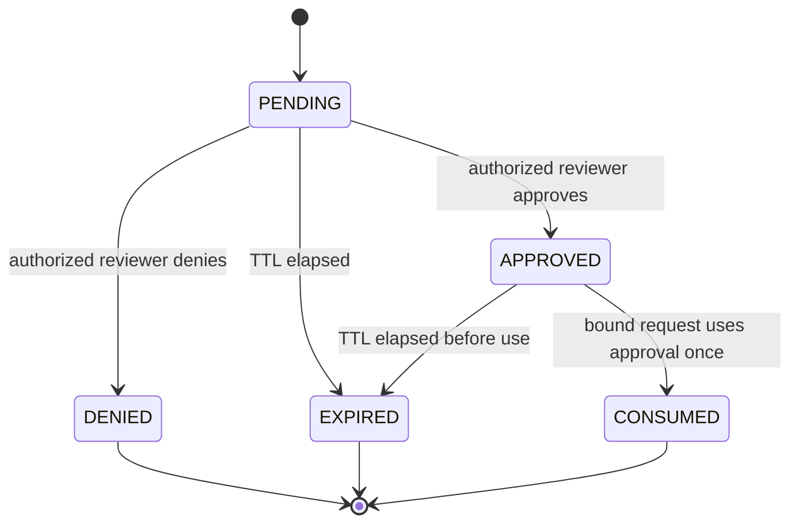

# M6 Human Approval

## Status

`in design`

## Problem

MCPShield can authenticate callers, evaluate deterministic policy, calculate risk, and block or redact sensitive payloads. It cannot pause a high-impact operation for a human reviewer. A policy decision such as `REQUIRE_APPROVAL` therefore has no safe execution path.

M6 adds a human-in-the-loop approval workflow with short-lived records, request binding, expiry, replay protection, reviewer authorization, and auditability. AI may explain or summarize an approval request but can never approve it.

## Out of scope

| Excluded capability | Reason |
| --- | --- |
| AI approval or autonomous approval | Human approval is the security boundary. |
| PostgreSQL implementation in the first slice | M6 first proves the state machine behind a repository interface; durable storage follows with the audit persistence work. |
| Full admin UI | API/use-case contract first. |
| Automatic retries after approval | Retry semantics depend on transport/session behavior. |
| Bulk approvals | Increases blast radius and is deferred. |
| Approval of arbitrary shell execution | Shell remains denied by default and requires separate controls. |

## Assumptions

| Assumption | Chosen default | Rationale | Confirmed? |
| --- | --- | --- | --- |
| Approval state | PENDING, APPROVED, DENIED, EXPIRED, CONSUMED | Explicit lifecycle prevents ambiguous reuse. | yes |
| TTL | short configurable expiry | Limits stale authorization. | yes |
| Binding | principal, tenant, upstream, tool, method, sanitized argument hash, policy/risk context | Prevents argument mutation and confused deputy replay. | yes |
| Reviewer | separate authenticated principal with approval scope | Requester cannot approve own privileged request by default. | yes |
| Consumption | one-time | Prevents replay after successful use. | yes |
| Storage | repository interface with in-memory test implementation | Keeps state contract independent from persistence choice. | yes |

**Open questions:** exact PostgreSQL schema and admin API authentication details are deferred to implementation design after human review.

## Acceptance criteria

### M6-AC1 - Approval request creation

When policy returns `REQUIRE_APPROVAL`, the system SHALL create a PENDING approval record containing a sanitized request summary, risk result, policy IDs, principal identity, expiry, and a binding fingerprint.

### M6-AC2 - Sensitive data boundary

The approval record SHALL never store raw bearer tokens, credentials, unsanitized arguments, or raw DLP-matched values.

### M6-AC3 - Reviewer authorization

Only an authenticated reviewer with the configured approval scope SHALL approve or deny a request, and the requester SHALL be rejected as reviewer unless explicitly configured otherwise.

### M6-AC4 - Expiry

An approval past its expiry SHALL transition to EXPIRED and SHALL not authorize execution.

### M6-AC5 - Fingerprint binding

Changing principal, tenant, upstream, method, tool, argument hash, policy context, or relevant risk context SHALL invalidate the approval.

### M6-AC6 - One-time consumption

An APPROVED record SHALL transition to CONSUMED atomically on use; a second use SHALL fail without invoking the upstream.

### M6-AC7 - Denial and cancellation

A DENIED, EXPIRED, or canceled request SHALL not reach the upstream and SHALL produce a sanitized audit event.

### M6-AC8 - AI boundary

No AI provider, model output, or explanation endpoint SHALL be able to transition an approval to APPROVED or CONSUMED.

### M6-AC9 - State-machine correctness

Invalid transitions SHALL fail deterministically, concurrent approval/use attempts SHALL allow at most one successful consumption, and all transitions SHALL be auditable.

## Traceability

| Requirement | Primary proof |
| --- | --- |
| M6-AC1 | Approval use-case creation test |
| M6-AC2 | Sanitization and raw-secret absence tests |
| M6-AC3 | Reviewer scope/self-approval tests |
| M6-AC4 | Expiry boundary tests |
| M6-AC5 | Fingerprint mutation tests |
| M6-AC6 | Concurrent one-time consume test |
| M6-AC7 | Denial/expiry proxy tests |
| M6-AC8 | API/type boundary test proving no AI transition path |
| M6-AC9 | State transition and race tests |

## Observable outcomes

- High-impact operations become pending instead of executing immediately.
- Approval is tied to the exact sanitized request and expires.
- Only authorized human reviewers can approve.
- An approval can be consumed once.
- Every creation, review, expiry, rejection, and consumption is auditable.

## Flow

1. Policy/risk result -> approval service creates PENDING record.
2. Reviewer authenticates -> approval service approves or denies.
3. Original request presents approval fingerprint -> service atomically consumes APPROVED record.
4. Only successful consumption -> proxy may invoke upstream.
5. Transition -> sanitized audit event.

## Relations

## Surface

| Surface | Decision | Landing |
| --- | --- | --- |
| approval creation | PENDING record for REQUIRE_APPROVAL | M6-AC1 |
| approval review | authorized approve/deny operation | M6-AC3 |
| approval use | atomic one-time consumption | M6-AC5, M6-AC6 |
| expired approval | EXPIRED and no upstream call | M6-AC4, M6-AC7 |
| audit | metadata-only transition event | M6-AC2, M6-AC9 |

## Landing

| Door | Decision | Rejected alternative |
| --- | --- | --- |
| state ownership | approval service/use case owns transitions | controllers mutating records directly |
| binding | canonical fingerprint over sanitized fields | approval ID alone |
| concurrency | atomic compare-and-consume repository operation | read-then-write consumption |
| AI | advisory explanation only | AI approval tool |

## Impact

| Area | Expected impact |
| --- | --- |
| Policy | `REQUIRE_APPROVAL` becomes an executable workflow boundary. |
| Proxy | Upstream calls wait for a bound, unexpired, one-time approval. |
| Audit | Approval lifecycle transitions become security events. |
| Persistence | Repository interface prepares PostgreSQL implementation without coupling the domain. |
| Operations | Approval backlog and expiry metrics become observable. |

## Sources

- `codex-go-mcpshield-eventscope.md` - approval, TTL, binding, and replay requirements.
- `.specs/features/m3-policy-engine/` - decision contract.
- `.specs/features/m4-risk-engine/` - risk context contract.
