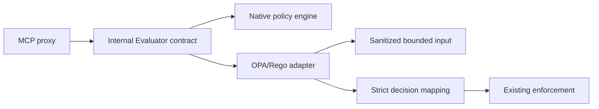

# M7 OPA/Rego Policy Adapter

## Status

`in design`

## Problem

MCPShield has a deterministic native policy engine with a stable internal Decision contract. Some operators need centralized OPA/Rego bundles, external policy review, and organization-wide policy distribution. Replacing the native engine would spread OPA types through the gateway and make local deterministic behavior dependent on an external evaluator.

M7 adds an optional OPA/Rego adapter behind the existing policy contract. Native policy remains the safe fallback and internal decision model. OPA can evaluate a sanitized input and return a mapped decision, but OPA, network availability, and policy data never change the meaning of the internal authorization boundary.

## Out of scope

| Excluded capability | Reason |
| --- | --- |
| OPA as an unconditional runtime dependency | Native policy must remain available for local and degraded operation. |
| AI-generated Rego or automatic policy deployment | Policy changes require review and explicit rollout. |
| OPA bundle distribution/control plane | Future operations work. |
| Raw secrets or full arguments in OPA input | Privacy boundary; only sanitized bounded input is allowed. |
| Policy decision caching without version binding | Risks stale authorization. |

## Assumptions

| Assumption | Chosen default | Rationale | Confirmed? |
| --- | --- | --- | --- |
| Adapter contract | `Evaluator` interface returning internal `policy.Result` | Keeps OPA types out of application code. | yes |
| OPA mode | explicit configuration, disabled by default | Preserves native local behavior. | yes |
| Failure mode | configurable fail-closed for protected routes, native fallback only when explicitly enabled | Avoids silent policy weakening. | yes |
| Input | sanitized principal, MCP metadata, risk metadata, and bounded arguments | Prevents secret leakage and unbounded policy input. | yes |
| Output | strict mapping to internal decisions | No arbitrary OPA output reaches proxy enforcement. | yes |

**Open questions:** OPA deployment topology and bundle lifecycle are deferred beyond the adapter slice.

## Acceptance criteria

### M7-AC1 - Internal evaluator contract

The gateway SHALL evaluate policies through an internal interface that returns the existing policy Decision/Result model and exposes no OPA-specific types to proxy code.

### M7-AC2 - OPA input sanitization

The adapter SHALL build bounded OPA input containing principal metadata, MCP method/tool/upstream, risk score/severity/signal IDs, and sanitized arguments without bearer tokens or raw DLP matches.

### M7-AC3 - Strict output mapping

The adapter SHALL accept only a validated OPA result shape and SHALL map allowed decision values to the internal decision enum, rejecting unknown or malformed outputs.

### M7-AC4 - Native fallback boundary

When OPA mode is disabled, the native evaluator SHALL remain the active evaluator. When OPA is unavailable, fallback SHALL occur only if explicitly configured and SHALL emit an audit event.

### M7-AC5 - Deny preservation

OPA output SHALL never convert a native or explicit `DENY` safety result into `ALLOW` without a documented evaluator precedence rule and test proof.

### M7-AC6 - Timeout and cancellation

OPA evaluation SHALL have an explicit timeout, request cancellation, and bounded response handling.

### M7-AC7 - Policy version/context

The result SHALL retain evaluator identity and policy version/context metadata for audit and stale-decision analysis.

### M7-AC8 - Simulation

The existing policy simulation path SHALL be able to select the OPA adapter without invoking an upstream or mutating active policy state.

### M7-AC9 - Observability and failure tests

The adapter SHALL emit fixed metrics and sanitized audit metadata for success, deny, timeout, malformed output, and fallback outcomes.

## Traceability

| Requirement | Primary proof |
| --- | --- |
| M7-AC1 | Internal evaluator contract compile/test |
| M7-AC2 | Sanitization and raw-secret absence tests |
| M7-AC3 | Output mapping matrix tests |
| M7-AC4 | Native/OPA mode and outage tests |
| M7-AC5 | Deny preservation tests |
| M7-AC6 | Timeout/cancellation tests |
| M7-AC7 | Version/context audit assertions |
| M7-AC8 | Simulation no-side-effect test |
| M7-AC9 | Metrics/audit and failure matrix tests |

## Observable outcomes

- Proxy code depends only on the internal evaluator contract.
- OPA receives bounded sanitized input.
- Malformed OPA responses fail safely.
- Native policy remains usable when OPA is disabled.
- Every OPA decision includes evaluator/version context for audit.

## Flow

1. Proxy builds typed policy input and sanitized OPA input.
2. Evaluator selection chooses native or OPA explicitly.
3. OPA adapter evaluates with timeout and strict output validation.
4. Adapter maps output to internal `policy.Result`.
5. Existing enforcement, approval, risk, DLP, and audit boundaries continue unchanged.

## Relations

## Surface

| Surface | Decision | Landing |
| --- | --- | --- |
| policy evaluation | Select native or OPA adapter explicitly | M7-AC1, M7-AC4 |
| OPA input | Sanitized bounded JSON | M7-AC2 |
| OPA result | Strict internal Decision mapping | M7-AC3 |
| OPA outage | Timeout and configured fallback/fail-closed | M7-AC4, M7-AC6 |
| simulation | Evaluate without upstream side effects | M7-AC8 |

## Landing

| Door | Decision | Rejected alternative |
| --- | --- | --- |
| OPA coupling | adapter behind internal interface | OPA types throughout proxy/policy code |
| availability | explicit fallback mode | silent fallback that weakens policy |
| output | strict allowlist mapping | accepting arbitrary boolean/result data |
| input | sanitized metadata-first payload | raw request forwarding to OPA |

## Impact

| Area | Expected impact |
| --- | --- |
| Policy | Adds an optional external evaluator without changing internal decisions. |
| Operations | Adds evaluator health, timeout, fallback, and version metrics. |
| Security | Preserves native default-deny and sanitized inputs. |
| Future work | Enables policy bundles and centralized governance later. |

## Sources

- `codex-go-mcpshield-eventscope.md` - native policy/OPA adapter requirements.
- `.specs/features/m3-policy-engine/` - internal policy Decision contract.
- `.specs/features/m4-risk-engine/` - bounded risk context contract.
